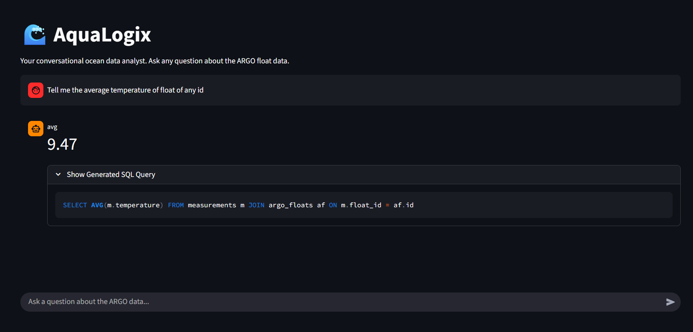
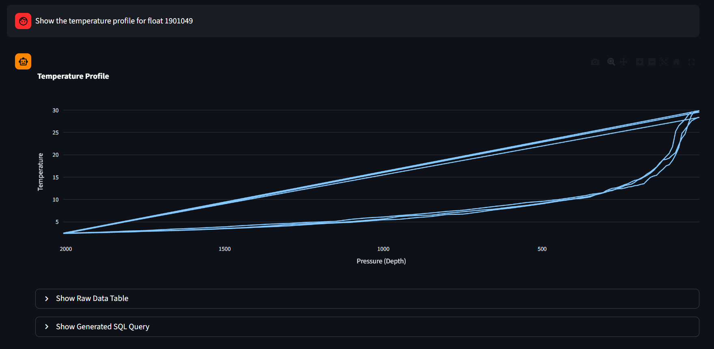
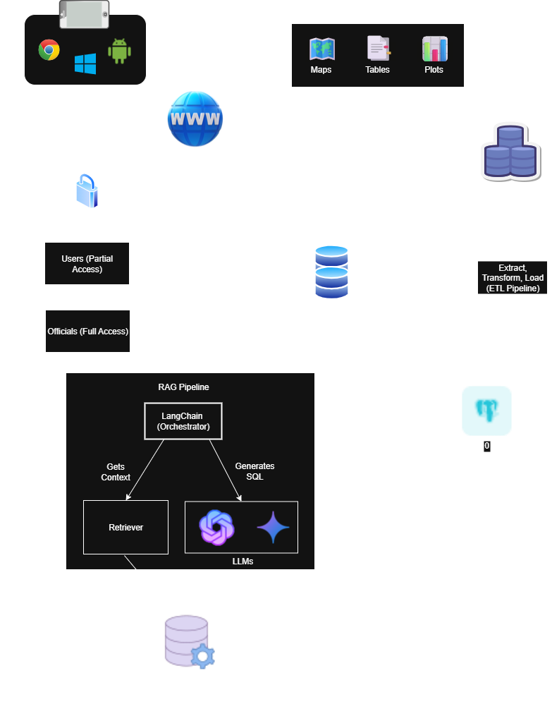

# 🌊 AquaLogix: A Conversational Ocean Data Analyst


[](https://www.python.org/downloads/)

AquaLogix is an AI-powered platform that revolutionizes how we interact with complex oceanographic data. It provides an intuitive conversational interface to query, analyze, and dynamically visualize vast datasets from ARGO floats, making ocean data accessible to everyone.

---
## Live Demo in Action

AquaLogix can understand complex questions, remember the context of the conversation, and generate a variety of visualizations on the fly.

**Generating a Profile Chart** 
 
 

---
## Key Features

* **Natural Language Queries**: Ask complex questions in plain English and get immediate, accurate answers.
* **Intelligent Text-to-SQL**: Powered by a local LLM (Ollama) and guided by robust prompt engineering to translate questions into precise SQL queries.
* **Dynamic Visualizations**: Automatically generates the best visualization for your data, including interactive tables, line charts, bar charts, and geospatial maps.
* **Conversational Memory**: Remembers the context of your current chat session, allowing for natural follow-up questions.
* **Automated Data Pipeline**: A resilient ETL script that processes raw ARGO NetCDF (`.nc`) files, standardizes data, and loads it into a structured PostgreSQL database.

---
## System Architecture

The system is built on a modern, decoupled architecture featuring a Python backend, a Streamlit frontend, and a local AI core. This ensures scalability and maintainability.



---
## Technology Stack

* **Backend**: Python, FastAPI, Uvicorn
* **Frontend**: Streamlit
* **Database**: PostgreSQL (for structured data)
* **AI/ML**: Ollama (`llama3:8b` or `gemma:2b`), LangChain, Sentence-Transformers
* **Data Handling**: Pandas, xarray, SQLAlchemy
* **Plotting**: Plotly

---
## Local Setup and Installation

### 1. Prerequisites

* Python 3.9+
* PostgreSQL Server
* Git
* [Ollama](https://ollama.com)

### 2. Clone and Set Up

```bash
# Clone the repository
git clone <your-repo-url>
cd AquaLogix

# Create a virtual environment
python -m venv venv

# Activate the environment
# On Windows:
venv\Scripts\activate
# On macOS/Linux:
source venv/bin/activate

# Install dependencies
pip install -r requirements.txt